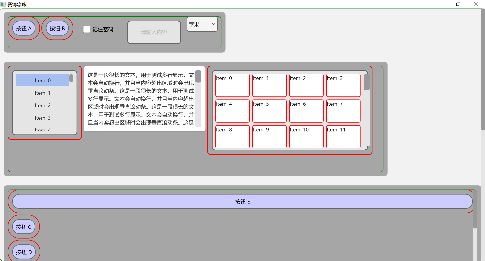

基于Direct2D的控件库

目前版本： v2.0.0.1

目标：争取让AI像写html一样很快且很漂亮的写window界面。所以此库诞生了。

设计理念：
风格设计仿css实现基本的功能。
背景： solid, linear, Radial。
边框： 圆角。
字体： 
每一个界面只有一个hwnd。将hwnd表示一个大矩形。将矩形进行分割，每一个小矩形表示一个
控件。由于Direct2D效率足够高所以每一次重绘所有的控件即可。

特别感谢: Deepseek 和 copilot。

